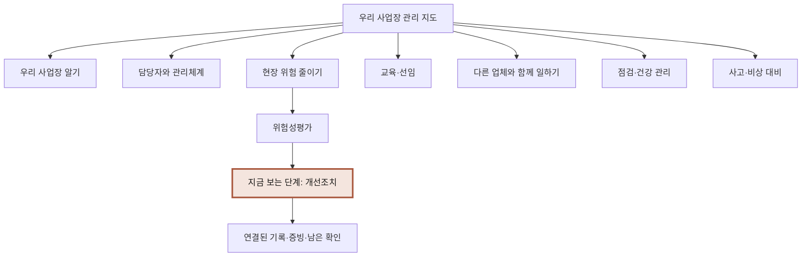

# 앱이 이끄는 안전관리 경험으로 개편

작성: 2026-09-18. 상태: **사용자 “진행해봐” 승인 · A~C 구현 및 로컬 검증 완료**. 실행 순서와 검증은 [구현 계획](2026-09-18-guided-safety-journey-implementation.md), 실제 결과와 미연동 범위는 [진행 기록](../PROGRESS.md)을 따른다. 아래 검토 당시 표현은 설계 이력이다.

사용자 확정 요구는 초보자가 다음 행동을 이해하도록 앱이 능동적으로 안내하고, 전체 업무·서류·증빙의 관계와 자신의 위치를 그림으로 파악하며, 중요한 일을 우선 처리하게 하는 것이다. 애니메이션·팝업을 포함한 큰 UX 변경을 요청했다.

아래의 구체 화면·저장 계약·구현 묶음은 검토안이다. 기본 방식에 대한 선택 응답 전에는 ‘단계 안내 + 전체 지도’를 제안 기준으로 사용한다. 직전 승인안의 ‘목록 우선·최대 3행’만으로는 새 요구를 충족하지 못하므로 홈의 기본 구조를 교체한다. 기존 기록·권한·상태 분리 원칙은 유지한다.

## 1. 현재 실패를 설명하는 근거

| 확인 위치 | 현재 구성 | 초보자가 겪는 문제 |
|---|---|---|
| `task-actions.ts`, `task-home.tsx` | 등록된 업무와 프로필 미확인 정보에서 다음 행동 생성 | 등록 업무가 없으면 등록증 보완부터 권하고, 첫 업무는 아래 후보에서 직접 찾아야 함 |
| `business-profile.tsx` | 등록정보 여러 칸으로 시작, 인원 단계에 여러 고용관계 구분 | 실제로 무엇을 관리할지 이해하기 전에 서식부터 채우게 됨 |
| `task-guidance.tsx` | 수행 순서·증빙·마무리 기준이 하나의 접힘 영역 | 안내가 필요한 순간에 목적·구체 행동·기록이 연결되어 보이지 않음 |
| `risk-assessment-form.tsx` | 7개 단계와 여러 입력을 동시에 제시, 단계 위치는 메모리 | 한 번에 할 일과 중단 후 돌아갈 위치를 알아내야 함 |
| 홈·상세 진행 표시 | 위험성평가의 기록 갖춤과 전체 관리 분야가 별개 | 입력한 한 기록이 전체에서 무엇을 채웠는지 보이지 않음 |

디자인·개발·운영 관점의 독립 에이전트가 읽기 전용으로 검토하고 고객 사용 시나리오를 대조했다. 실제 부서 회의·고객 인터뷰·신규 사용성 시험 결과는 아니다.

## 2. 선택지와 추천

| 안 | 경험 | 장점 | 감수할 점 |
|---|---|---|---|
| **A. 단계 안내 + 전체 지도(추천)** | 오늘 한 가지를 제안하고 짧은 질문·실행·증빙으로 연결. 언제든 전체 위치 확인 | 방향 제시와 전체 이해를 동시에 제공, 저장 사실에 근거해 구현 가능 | 안내 문구·단계별 입력 기준을 업무마다 설계해야 함 |
| B. 대화형 안내 중심 | 대화로 상황을 듣고 관련 화면 추천 | 질문하기 편함 | 대화에서 누락·버전·정확한 입력 위치를 찾기 어려우며 현재 AI도 미연동 |
| C. 자유 탐색 + 도움말 | 지도·목록을 먼저 열고 필요할 때 안내 | 숙련자에게 빠름 | 무엇을 골라야 할지 모르는 첫 이용자의 부담이 남음 |

A를 기본 경험으로, C의 직접 탐색을 함께 제공한다. 능동 안내는 확인된 데이터와 정의된 분기로 먼저 구현한다. LLM이 법적 적용이나 수행 사실을 대신 결정하지 않는다.

## 3. 화면 구조

주 탐색은 **오늘 / 전체 지도 / 자료 / 검토·보완**이다. 현장 선택·설정·긴급 연락은 항상 찾을 수 있는 위치에 둔다. 기존 업무 목록·검색·직접 기록은 전체 지도의 목록 보기와 자료에서 접근한다.

### 오늘: 지금 함께 할 한 가지

첫 화면에서 현재 상황, 권하는 이유, 실제 다음 행동을 제시한다. 주 버튼은 하나로 두고 다른 일·기존 자료 선택도 허용한다. 중요 업무를 뒤에 숨기지 않되 모든 업무를 첫 화면에서 나열하지 않는다.

설명용 화면 예시 — 실제 고객 상태가 아니며 예시를 사실로 저장하지 않는다:

```text
한결 시설관리                         전체 지도

먼저 함께 살펴볼 작업을 정해볼까요?
시설 점검·청소 작업을 한다고 알려주셔서 제안해요.
어떤 장소에서 누가 일하는지부터 함께 정리해요.

[ 살펴볼 작업과 장소 정하기 ]
이미 준비한 기록이 있어요       다른 일 보기

내 위치: 현장 위험 줄이기 › 위험성평가 › 준비
다음에는 함께 일하는 사람에게 무엇을 물어볼지 안내해요.
```

처음 들어온 고객에게도 안내할 첫 업무가 있어야 한다. 관련 업무가 적용 확정 전이면 ‘적용 확인이 필요한 추천’으로 알리고 상황 확인부터 시작한다. 등록증의 미확인 주소처럼 현재 업무를 막지 않는 보완이 항상 최우선이 되지 않게 한다.

우선순위는 저장된 미해결 조치·보완·확인된 목표일·현재 작업을 막는 질문·중단한 작업·관련 첫 업무를 함께 고려한다. 각 추천에는 이유를 표시한다. 임의 법정 기한·법적 중요도 점수·작업 완료 예상 시간을 만들지 않는다. 급박한 위험 안내는 일반 추천 순서와 별개로 즉시 접근한다.

### 처음 사용하는 흐름

| 화면 | 먼저 설명할 내용 | 중심 행동 |
|---|---|---|
| 시작 | 사업장 정보에서 실행·기록·보관까지 무엇을 도와주는지 작은 그림으로 안내 | 우리 사업장부터 시작 / 기존 자료 찾기 |
| 장소 | 지금 관리할 사업장과 실제 작업 장소 | 아는 정보 입력·저장 |
| 작업 | 실제 하는 일을 익숙한 표현과 간단한 예시로 설명 | 선택 또는 직접 설명 |
| 사람 | 직접 고용한 사람부터 묻고 필요한 고용관계 질문을 차례로 안내 | 확인한 값 또는 모름 |
| 우리 지도 | 확인한 사실과 앞으로 관리할 분야·미확인 범위 | 추천한 일 시작 / 다른 분야 보기 |
| 첫 업무 | 왜 필요한지와 첫 행동. 처음 준비/기존 기록 있음/모름에 따라 분기 | 현재 상황에 맞는 행동 |

이 화면 수는 설명을 위한 구성안이며 모든 고객에게 강제하는 고정 절차가 아니다. 기존 사실은 확인부터 시작하고 다시 입력시키지 않는다. 미확인 정보가 있어도 지도·설명은 열어둔다. 신규 업무 생성에 필요한 최소 사실·확인은 기존 서버 기준을 지키고, 부족한 사실은 그 업무에서 이유와 함께 묻는다.

### 전체 지도: 업무와 자료의 관계

지도는 업무의 관계와 탐색 위치를 보여준다. 아래 분류가 법령 전체 목록이나 법적으로 반드시 따라야 할 순서를 뜻하지 않는다. 각 분야에는 여러 업무·회차가 동시에 존재한다.



- 데스크톱: 관계도와 선택한 분야의 상세 패널. 모바일: 세로로 이어진 지도와 펼치는 가지. 축소된 거대한 캔버스를 기본 조작으로 강요하지 않는다.
- 지도/목록 보기를 전환하며 같은 상태·이름·개수를 사용한다. 키보드·화면낭독에서도 각 가지와 다음 행동을 찾을 수 있다.
- 현재 위치를 고정 문구로 표시한다. 예: `전체 지도 › 현장 위험 줄이기 › 위험성평가 › 개선조치`.
- 접힌 가지에는 다음 행동과 남은 확인 수를 보여주고, 펼치면 자료·수행 기록·검토·접수 상태를 구분한다.
- 기존 기록은 재사용 가능한 원본으로 연결한다. 새로 수행·확인한 사실처럼 복사하거나 완료 표시하지 않는다.

### 한 업무: 한 번에 이해할 수 있는 행동

한 화면은 **왜 하는지 → 지금 할 행동 또는 짧은 질문 → 예시/도움 → 저장 결과와 다음 행동**으로 구성한다. ‘아직 모르겠어요’, ‘아직 실행하지 않았어요’, ‘자료는 나중에 연결할게요’를 구분한다.

위험성평가에서는 기존 7단계를 상위 흐름으로 유지하되 세부 질문을 나누고 필요한 설명을 해당 위치에 붙인다. 모든 단계 버튼과 긴 입력을 한꺼번에 노출하지 않는다. 이미 알고 있는 담당자는 원하는 단계로 바로 갈 수 있다.

‘모르겠어요’를 선택하면 설명용 그림·예시·무엇을 누구에게 확인할지 안내하는 하단 패널을 연다. 화면 방문이나 설명 읽기는 수행 완료로 저장하지 않는다. 예시는 자동 입력하지 않으며 실제 자료 업로드와 혼동되지 않게 표시한다.

### 자료와 증빙: 무엇을 위해 남기는지

문서 이름만 나열하지 않고 `무엇을 확인하기 위한 자료인지 → 어느 업무·단계의 자료인지 → 연결된 저장 버전 → 남은 확인`을 보여준다. 확인된 근거가 있는 법정 서식, 공식 참고 자료, 자체 기록 도구를 구별한다.

예시로 개선 전후 사진은 어떤 조치를 기록하는지, 작업자 의견은 언제 누구에게 들은 내용인지 연결한다. 파일이 있다는 사실이나 악성 파일 검사 통과를 증빙 요건 충족으로 판정하지 않는다. 버전 변경 시 기존 증빙을 새 활동의 증빙으로 자동 확정하지 않는다.

## 4. 진행 상황의 의미

사용자는 얼마나 진행했는지 알아야 한다. 진행 그림마다 **집계 대상·기간/회차·기준·현재 상태**를 함께 제공한다.

| 표시 | 계산·표시 원칙 |
|---|---|
| 이번 안내에서 확인한 정보 | 정해진 질문 중 확인하여 저장한 항목 수. 모름·건너뜀은 남은 확인 |
| 이번 평가의 기록 갖춤 | 동일한 정의 버전·저장 버전의 필수 기록 기준. 예시 `3/7단계`는 법적 완료율이 아님 |
| 위험 판단 확인 필요 | 아직 판단할 사실·결과가 없는 위험요인 수 |
| 개선·재확인 필요 | 저장 기록에 명시된 개선 필요와 조치 후 확인이 남은 수 |
| 실제 수행 기록 있음 | 해당 단계·대상·회차와 연결할 수 있는 실제 기록만 표시. 텍스트 저장이나 파일 첨부로 대체하지 않음 |
| 자료 검토·제출/접수 | 별도 사건·증거에 근거한 상태. 사람 검토와 기관 접수는 서로 다름 |

현재 일반 업무는 메모·답변 위주라 단계별 수행 완료율을 계산할 수 없다. 해당 분야는 기록 수와 남은 확인을 표시하고, 구조화된 기준이 마련된 업무부터 범위가 명확한 진행률을 제공한다. 전체 후보 수를 분모로 한 ‘법적 준비 80%’, ‘사업장 안전 100%’는 만들지 않는다.

현재 상세의 `riskProgress.unresolvedCount`는 미판단도 포함하고 홈의 `improvement_count`는 명시된 개선 필요를 집계한다. 새 화면은 둘을 같은 수치로 표시하지 않고 위의 두 항목으로 통일한다. 저장이 성공한 후에만 지도 상태를 갱신한다. 작성 중인 값은 별도 표시한다.

## 5. 애니메이션·팝업·그림

| 상황 | 사용할 표현 | 동작 기준 |
|---|---|---|
| 첫 방문 | 건너뛰고 다시 볼 수 있는 짧은 흐름 안내 | 긴 튜토리얼을 강제로 완료시키지 않음 |
| 질문/단계 이동 | 짧은 전환과 현재 위치 강조 | 입력·키보드 포커스 유지, 동작 줄이기 설정 지원 |
| 모르는 항목 | 그림·예시·확인 방법을 담은 하단 패널 | 닫기·뒤로·원래 위치 복귀, 팝업 중첩 방지 |
| 저장 성공 | 저장한 항목이 지도에 반영되는 변화와 다음 행동 | 서버 저장 성공 후 실행. ‘자료 저장’을 축하하며 이행·안전 확보로 표현하지 않음 |
| 보완·오류 | 해당 입력 위치 강조와 해결할 행동 | 저장 실패 입력 보존, 미저장 이동 보호를 우회하지 않음 |
| 중요한 새 상황 | 맥락이 있는 안내 배너, 필요한 경우 확인창 | 근거와 중요도를 설명하며 반복 강제 노출하지 않음 |

장식보다 사용자가 ‘어디로 이동했고 무엇이 저장됐는지’를 이해하도록 움직임을 쓴다. 회전 카드·자동 재생·지속적인 점멸·근거 없는 카운트 증가를 넣지 않는다. 그림은 설명 자료이며 실제 고객 증빙과 구분한다. 모션 감소 설정에서도 같은 정보와 작업이 제공되어야 한다. 긴급 안내는 어떤 패널에서도 바로 접근한다.

색상은 기존 크림·코랄을 기반으로 하고 업무 화면의 글자·간격·버튼·아이콘을 새 안내 구조에 맞게 재정렬한다. 토스의 로고·화면을 복제하는 안이 아니다.

## 6. 구현 계약과 전환

일반 워크플로 엔진을 먼저 만들지 않고 사업장 입력과 위험성평가부터 고정된 단계 정의를 만든다.

| 구성 | 최소 역할 |
|---|---|
| JourneyDefinition | 흐름 ID·버전, 고정 단계 ID, 목적·행동·필요 입력·안내·기록 기준·다음 연결 |
| JourneyProjection | 홈·지도·업무 안내가 함께 사용하는 저장 기준 요약. 프로필 revision·기준 버전·위험 판단/개선 필요·파일 상태·검토 상태·우선순위 이유 |
| 사용자별 안내 상태 | 마지막 접근 단계, 안내 닫음/다시 보기. 업무 사실·이행 상태와 별도 저장 |
| 단계 직접 연결 | 명시된 허용 단계 URL → 접근 가능한 마지막 위치 → 첫 확인 필요 단계. 과거 버전은 그대로 유지 |
| 자료 연결 | 우선 기존 문서·버전 연결을 명확히 표시. 단계·위험요인별 증빙 요건 계산은 연결 스키마·검증 기준을 만든 뒤 제공 |

- 기존 일괄 요약 RPC와 권한·감사를 확장한다. 홈·지도에는 문서 원문을 보내지 않고 문서별 상세 조회를 반복하지 않는다. 최신 버전·검토·파일 상태는 같은 조회 기준으로 묶는다.
- 서버 저장·검증·revision 충돌·미저장 이탈 보호를 재사용한다. 안내 패널을 닫거나 단계 이동 애니메이션이 끝났다는 이유로 활동·승인 상태가 바뀌지 않는다.
- 단계 이동만 저장한 UI 상태와 사용자 입력 사실을 구분한다. `저장하고 다음`은 실제 저장 성공 후 이동하며 오류면 입력과 위치를 유지한다. 원문을 브라우저 영구 캐시에 넣지 않는다.
- 기존 URL·저장본·질문 원문·다운로드·자료함은 보존한다. 새 디자인을 이유로 기존 사실·증빙·검토 이력을 새로 쓰지 않는다.
- 안내 버전 변경 때 이전 단계와 연결할 수 없으면 확인 대상으로 남기고 원문과 버전을 보존한다. 권한 없는 현장·민감자료·과거 버전 편집 우회는 차단한다.

## 7. 실행 순서와 결과물

‘작은 홈 카드 수정’으로 끝내지 않고 아래 A~C를 하나의 UX 개편 범위로 잡는다. 개발 의존성에 따라 순서대로 검증하며 각 범위를 실제 저장·재개와 연결한다.

| 묶음 | 결과물 | 인수 기준 |
|---|---|---|
| A. 공통 구조·안내 홈·지도 | 공통 단계/상태 계약, 오늘 화면, 업무 관계도, 목록 보기, 첫 업무 추천 | 등록 업무가 없어도 다음 행동이 보이고 지도에서 현재 위치·다른 분야 접근 가능. 적용 미확인은 유지 |
| B. 사업장 입력·위험성평가 전면 안내 | 짧은 질문, 상황별 분기, 실행 설명·예시 패널, 저장하고 다음, 위치 재개, 저장 전후 지도 변화 | 처음 시작→실제 입력→중단→재개→저장→증빙/보완까지 연결. 화면만 바꾸고 입력 흐름을 남겨두지 않음 |
| C. 자료·증빙·검토 연결 | 업무별 자료 목적·버전·남은 확인 표시, 중요 작업에 연결된 보완, 모션·모바일 다듬기 | 자료를 찾고 무엇이 아직 부족한지 설명할 수 있음. 파일 검사·사람 검토·이행·접수 분리 |
| 후속 | 회차 관리와 교육·선임·도급·점검/건강별 구조화 안내 | 실제 대상·행동·증빙 기준을 만든 업무부터 진행률을 확장 |

기존 다음 작업이던 위험성평가 회차 원장보다 사용자 요청의 안내 UX 개편을 먼저 둔다. 회차가 없는데 평가 버전을 회차로 부르지 않는다. 실제 인증·파일 검사·백업/복구와 법령 승인 준비는 병행·미완료 항목으로 유지한다.

## 8. 검증과 미완료 범위

- 신규/기존 고객, 모름/0, 단계 건너뜀·복귀, 미저장/저장 실패·재시도, 두 탭 충돌, 버전별 자료·보완·내보내기, 타현장/민감자료 접근 차단.
- 홈·지도·상세가 같은 저장본에 대해 같은 숫자·상태를 표시하는지 검증. 미판단과 개선 필요, 문서 버전과 평가 회차를 섞지 않음.
- 모바일·키보드·화면낭독 순서, 팝업 포커스·닫기·복귀, 모션 감소, 지도 대신 목록으로 동일 작업, 긴급 연락 독립 접근.
- 실제 초보 사용자 5명 중 4명이 설명 없이 다음 행동과 전체 위치를 찾고 첫 저장→재개→보완을 수행하는 것을 목표로 삼는다. 모든 참여자가 저장·검토·실제 수행·기관 접수의 차이를 설명하는지 확인한다. 목표치이며 실행 결과가 아니다.
- 이번 문서는 설계안이다. 신규 코드·사용성 시험·법령 승인·실제 공급자 연결을 완료했다고 보고하지 않는다. 실제 승인 규칙 0개, 세부 조문 미연결 73개, 실제 Auth/Storage/파일 검사/복구 미검증 상태를 유지한다.

## 9. 참고 근거

제품에 대한 진단은 위 로컬 코드와 기존 화면·진행 기록을 바탕으로 했다. 아래 자료는 UX 표현·접근성 설계의 참고이며 법령 판단 근거가 아니다.

- [토스의 8가지 라이팅 원칙들](https://toss.tech/article/21022): 필요한 메시지를 쉽게 쓰고 다음 화면을 예상할 수 있게 안내하는 원칙을 참고했다. 적용 방식은 이 제품에 대한 설계 제안이다.
- [W3C Modal Dialog Pattern](https://www.w3.org/WAI/ARIA/apg/patterns/dialog-modal/): 팝업의 키보드 접근·닫기·포커스 복귀 기준을 참고했다.
- [W3C Animation from Interactions](https://www.w3.org/WAI/WCAG22/Understanding/animation-from-interactions.html): 불필요한 상호작용 모션을 줄일 수 있게 하는 기준을 참고했다.
